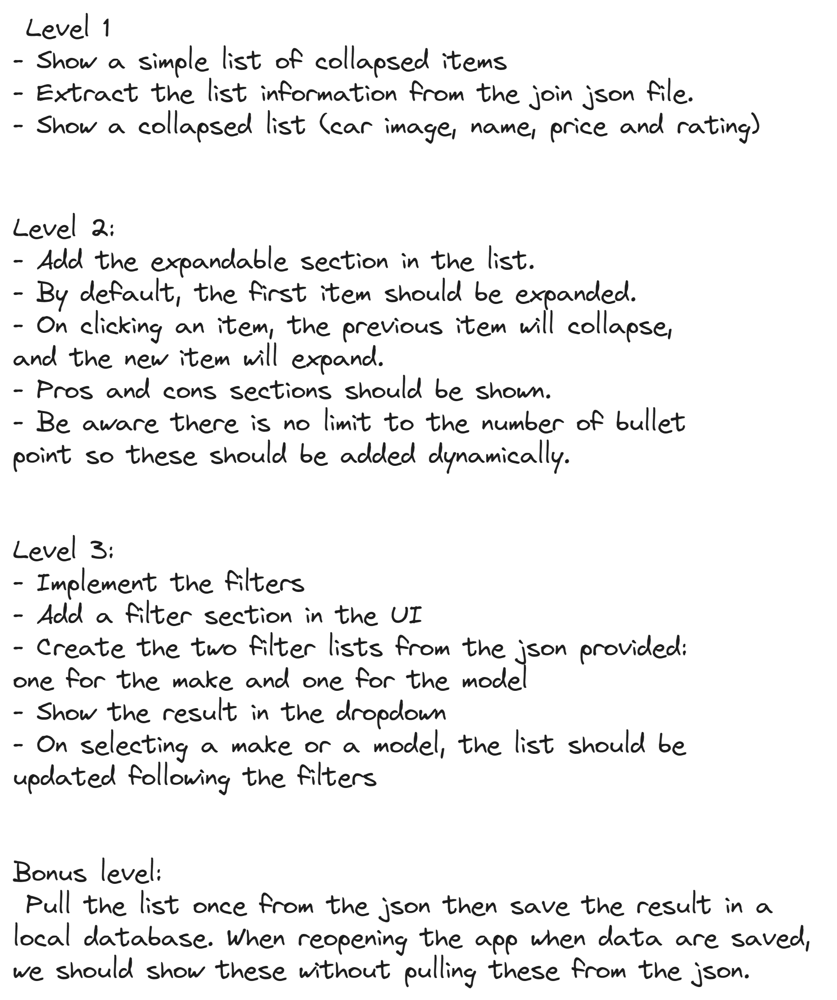
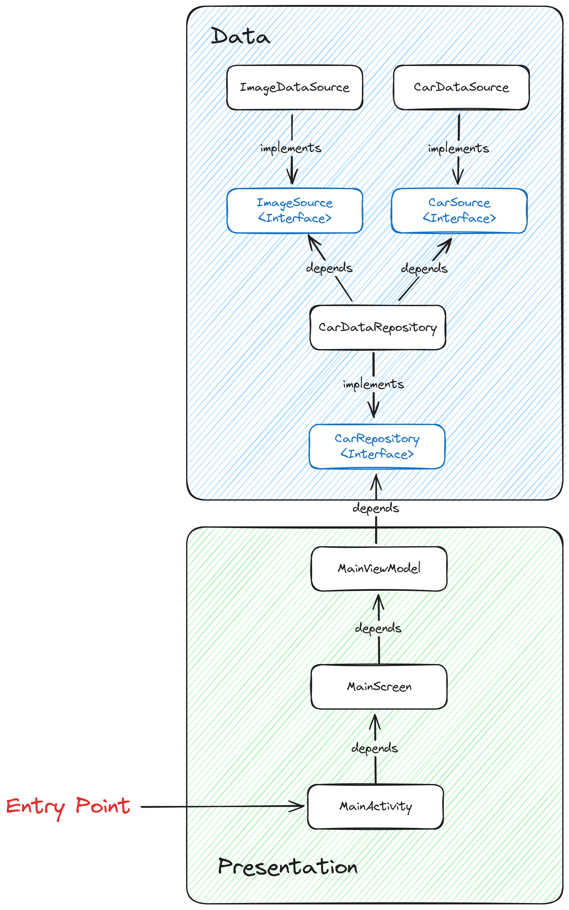
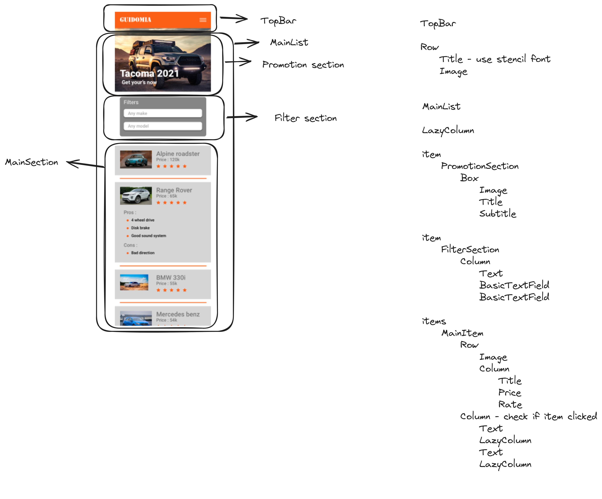

# Car

## Requirement

## Library

- Jetpack Compose - for rapid and concise UI development.
- Hilt for dependency Injection - for managing class dependencies.
- Mockito - used for helping mock object in unit tests.
- KotlinX Serialization - for deserialization of Json object.

## Others

- Added spotless to enforce coding guidelines.

## Project Architecture

### Level 1

## User Interface Draft

