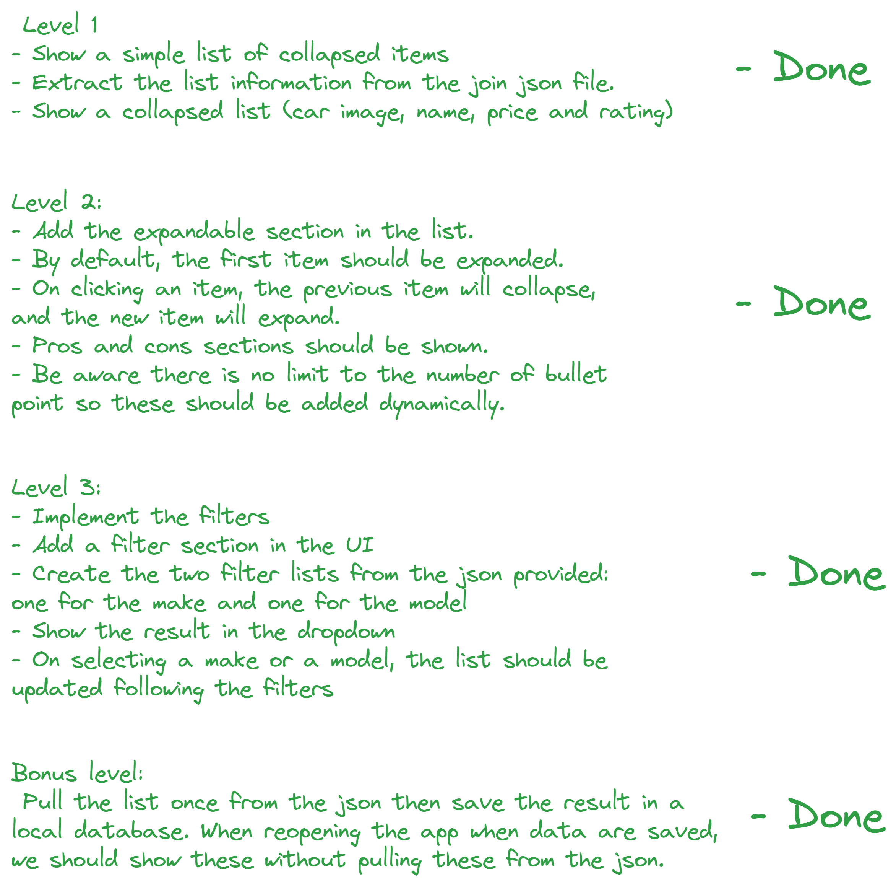
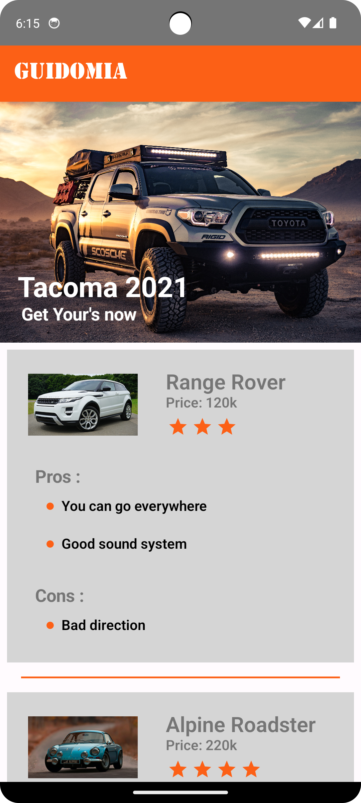
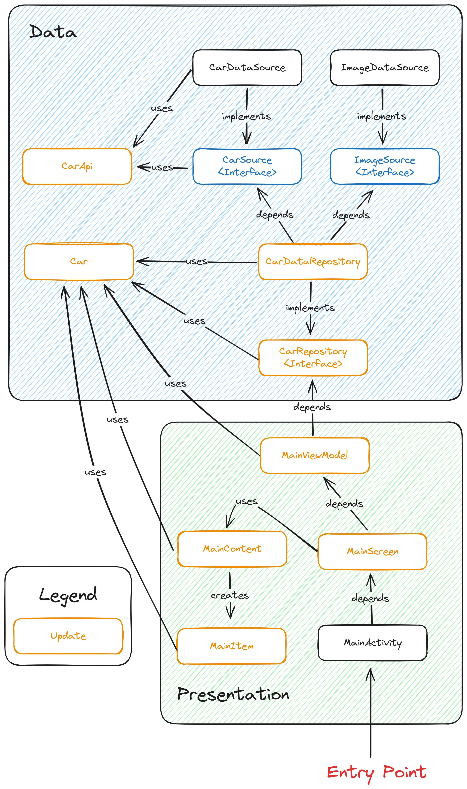
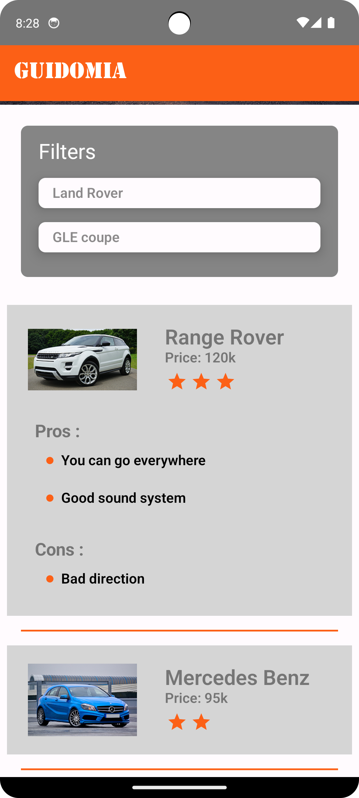

# Car

## Requirement

## Library

- Jetpack Compose - for rapid and concise UI development.
- Hilt for dependency Injection - for managing class dependencies.
- Mockito - used for helping mock object in unit tests.
- KotlinX Serialization - for deserialization of Json object.

## Others

- Added spotless to enforce coding guidelines.

## I. Level 1 Result

### Functionality

- Added Stencil font for app title.
- Added promotion section.
- Added main list for showcasing the featured cars.
- Fetch the cars using local json file.
- Add a 5 star rating limit when showing rating of a car.
- When getting the name of the car to put in the list, show both make and model name.
- When Land Rover is the item in the list, use the model name only.
- When Mercedes Benz is the item in the list, use the make name only.
- Shorten the price when price range above 1,000.
- Load local image by fetching the image id in ImageDataSource.
- Enforce coding guidelines using spotless.
- Add Unit testing for no dependency in Android.
- Add Android Test when dependent in Android.
- Add Github Action to make sure project can be run in other environment.
- Add hilt a dependency injection library to manage dependencies.
- Use compose to create the UI.
- Add colors and textStyle for reusable utility components.

### Sample Screenshot

   

### Project Architecture

## II. Level 2 Result

### Functionality

- Add bulletin point image.
- Add expandable functionality.
- Add list of pros and cons.
- Add default value is expanded.
- Add click event in main list.
- Update and add more unit tests.

### Sample Screenshot

   

### Project Architecture

## III. Level 3 Result

### Functionality

- Add filter section UI.
- Add dropdown functionality.
- Add fetching of list of make and list of model.
- Update and add more unit tests.
- Add filter functionality.

### Sample Screenshot

   
   

### Project Architecture

## User Interface Draft

